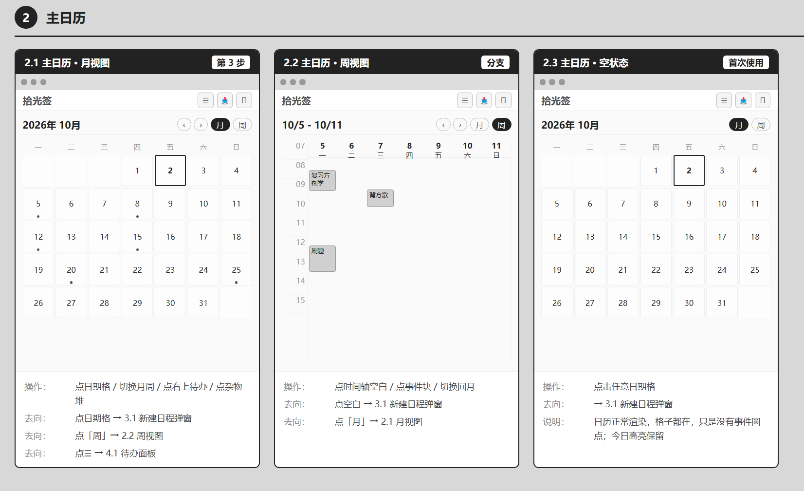
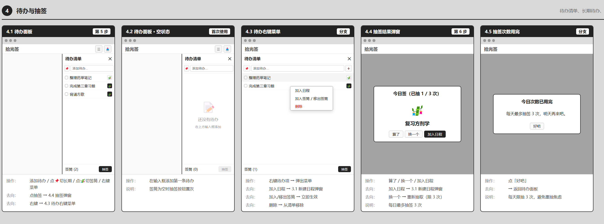
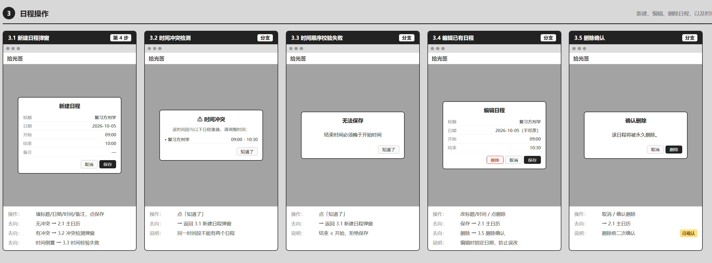

---

# 拾光签 / Shimmer — 作品集

> 一款纯本地的学习管理工具，解决"计划列了却执行不下去"的问题。  
> 从需求定义、规则设计到开发落地与质量验收，个人独立完成全链路。

## 目录

1. 发现问题
2. 定义方案（产品设计）
3. 核心业务规则设计
4. 原型与界面
5. 项目演示
6. 产品验收与质量闭环
7. 验证性测试发现的 Bug
8. 探索性测试发现的 Bug
9. Bug 追踪汇总表
10. 项目复盘与能力沉淀

---

## 第一部分：发现问题

**痛点**：

我时常担心自己错过重要的通知，因为通知散落在 QQ群、教务网、学习通等多个地方，凌乱的信息来源让我感到焦虑。同时，我列了待办清单却总是执行不下去，因为不知道从哪件开始。

---

## 第二部分：定义方案（产品设计）

### 起点

这个产品最早来自上学期的小组作业——一个叫 duedate 的 DDL 提醒日历，我是组长，负责搭建框架。它解决的是"通知乱、DDL 多而杂"的问题。而拾光签想解决的是另一半：计划列了却执行不下去。从提醒到行动，是同一个问题的两端。

当时发现朋友经常约着一起学习，于是想把 duedate 延展成一个学习管理工具。

### 原始设想（V1）

在最初的设想里，它不只是一个日历：

- **社交预约**：点击好友空闲时间，发起学习邀约
- **学习周报**：每周生成学习记录
- **好友互动**：送礼物、一起养猫（猫隶属学习小组，小组 1 到多人，一个人也能养，可以买猫粮）
- **商业化**：付费皮肤、礼物、猫粮

### 三个关键取舍

**取舍一：砍掉"点好友日程表邀约"**

原始设计里，好友可以互相查看日程表并发起邀约。但仔细想，这有两个问题：

1. 日程表被看见，本身就是一种社交压力
2. 邀约需要对方确认，容易变成"已读不回"的尴尬

改成：日程表完全私人，好友不可见；邀约改到小组公屏，用户自行确认是否有空。

**取舍二：砍掉"一起养猫"和付费设计**

一起学习很难有陪伴感，所以原本想用"一起养猫"来补——猫隶属学习小组，可以买猫粮，皮肤、礼物、猫粮构成付费点。

但评估后发现两个硬卡点：

1. **猫的动画做不出来**：猫要能跑、能睡、能互动，这是核心体验，做不出来整个功能就没有意义
2. **工期太长**：社交、周报、礼物、养猫、付费，全部实现至少需要数月，个人独立开发做不完

所以全部砍掉。

**取舍三：砍掉线上交友**

为了降低社交压力，不做线上交友功能。每个用户有一个学号，只有本来认识的朋友才能添加，避免陌生人社交带来的负担。

### 从 duedate 到拾光签：杂物堆的由来

duedate 里有个附加功能是"粘贴识别通知、邮箱授权拉取"——把外部通知抓进来整理。

这个思路在拾光签里简化成了杂物堆：不做自动拉取，改为手动粘贴暂存。duedate 里还有个附加功能是邮箱拉取：用户开启 IMAP/SMTP 服务后生成 16 位授权码，后端用 `imaplib` 连接邮箱、拉取未读邮件、调用粘贴识别模块提取 DDL 草稿。小组作业里已经跑通过。

但这个思路在拾光签里简化成了杂物堆：不做自动拉取，改为手动粘贴暂存。

原因是：IMAP 授权码登录本身能跑通，但要做成拾光签里的功能，还要处理多邮箱适配（QQ/163/126 的 IMAP 服务器地址不同）、授权码的安全存储、邮件正文的解析兼容性，以及用户愿不愿意把邮箱授权给一个学生做的桌面应用。个人开发维护成本较高，所以放弃自动拉取，只保留手动粘贴。

杂物堆独立于待办，是"还没想清楚的事"的暂存区，需要手动转为待办，不污染已有的计划。

### 最终方案（V2）

开发困难，V1 全部砍掉，只留下最核心的三件事：

- **日历**：月/周视图，时间冲突检测
- **待办**：清单 + 长期待办
- **签筒**：每日限 3 次，把"不知道学什么"变成随机趣味

这三件事背后的硬性规则，在第三部分展开。

### 视觉与 AI 工作流

- **视觉**：磨砂半透明日历 + 待办，森系桌面风格，手绘插画背景，平衡美观与专注度
- **AI 辅助**：利用 AI 工具辅助代码生成与逻辑梳理，个人独立完成从需求分析、界面设计到开发落地的全链路

---

## 第三部分：核心业务规则设计

产品的核心逻辑，最终收敛为四条硬性规则。这些规则决定了状态如何流转、边界如何处理：

| 功能 | 规则 | 设计意图 |
|---|---|---|
| 时间冲突检测 | 同一时间段不能有两个日程 | 防止计划撞车，保证可执行 |
| 长期待办 | 加入日程时创建副本，原件保留 | 重复性任务不丢失 |
| 签筒 | 每日最多抽 3 次 | 避免无限重抽变成另一种焦虑 |
| 杂物堆 | 独立于待办，需手动转为待办 | 不确定的事先暂存，不污染计划 |

---

## 第四部分：原型与界面

### 原型截图





### 原型演化

| 版本 | 状态 | 说明 | 链接 |
|---|---|---|---|
| **V1 原始设想** | 已砍 | 社交预约 + 小组 + 养猫 + 周报 + 付费 + 邮箱拉取 | [查看 →](./shimmer_v1.html) |
| **V1.5 中途改版** | 已砍 | 日程改私人、邀约改公屏、小组单人可建 | [查看 →](./shimmer_v1_5.html) |
| **V2 最终方案** | ✅ 已落地 | 日历 + 待办 + 签筒 | [查看 →](./shimmer.html) |

---

## 第五部分：项目演示

<div>
<iframe 
  src="//player.bilibili.com/player.html?isOutside=true&aid=117296513222884&bvid=BV1hGe46UE7H&cid=42024042939&p=1" 
  scrolling="no" 
  border="0" 
  frameborder="no" 
  framespacing="0" 
  allowfullscreen="true"
  width="100%" 
  height="400">
</iframe>
</div>

---

## 第六部分：产品验收与质量闭环

### 1、测试方法概述

在验收过程中，我采用了两种互补的方法：

| 方法 | 说明 | 适用场景 |
|---|---|---|
| **验证性测试** | 基于产品规则设计测试用例，逐条验证 | 核心算法、状态流转、边界条件 |
| **探索性测试** | 模拟真实使用场景，自由操作，观察异常 | 交互体验、异常路径、意外组合 |

两种方法各有侧重：验证性测试确保**已知规则**被正确实现，探索性测试发现**未知问题**。

### 2、测试用例总表

| 用例编号 | 测试模块 | 测试场景 | 前置条件 | 操作步骤 | 预期结果 | 实际结果 |
|---|---|---|---|---|---|---|
| TC-01 | 时间冲突检测 | 完全重叠 | 已有9:00-10:00日程 | 新建9:00-10:00日程 | 弹窗拦截 | 通过 |
| TC-02 | 时间冲突检测 | 部分重叠 | 已有9:00-10:30日程 | 新建10:00-11:00日程 | 弹窗拦截 | 通过 |
| TC-03 | 时间冲突检测 | 首尾相接 | 已有9:00-10:00日程 | 新建10:00-11:00日程 | 保存成功 | 通过 |
| TC-04 | 时间冲突检测 | 时间倒置 | 无 | 开始10:00，结束09:00 | 弹窗拦截 | **失败→BUG-01** |
| TC-05 | 日程编辑 | 编辑后保留日期 | 已有日程 | 编辑时间，保存 | 日期不变 | **失败→BUG-02** |
| TC-06 | 窗口切换 | 切换杂物堆 | 主界面 | 切换到杂物堆 | 正常显示 | **失败→BUG-03** |
| TC-07 | 路由跳转 | 杂物堆返回 | 杂物堆界面 | 点击🏠按钮 | 返回主界面 | **失败→BUG-04** |
| TC-08 | 应用退出 | 托盘退出 | 主窗口隐藏 | 托盘菜单点退出 | 应用关闭 | **失败→BUG-05** |
| TC-09 | 数据持久化 | 添加后重启 | 无 | 添加日程，重启App | 日程仍在 | 通过 |
| TC-10 | 长期待办 | 加入日程 | 有长期待办 | 右键加入日程 | 待办保留，日历新增 | 通过 |
| TC-11 | 签筒 | 抽签限次 | 今日已抽3次 | 第4次点击签筒 | 提示次数用完 | 通过 |
| TC-12 | 杂物堆 | 转为待办 | 有杂物 | 右键转为待办 | 待办新增，杂物删除 | 通过 |
| TC-13 | 杂物堆 | 加入日程 | 有杂物 | 右键加入日程 | 日历新增，杂物删除 | 通过 |

---

## 第七部分：验证性测试发现的 Bug

这些 Bug 是我**先根据产品规则设计了测试用例，执行时发现实际结果与预期不符**。

### BUG-01：结束时间早于开始时间，系统未阻止

| 项目 | 内容 |
|---|---|
| **对应规则** | 结束时间必须晚于开始时间 |
| **测试用例** | 创建事件，开始时间 10:00，结束时间 09:00 |
| **预期结果** | 弹窗提示"结束时间必须晚于开始时间"，拒绝保存 |
| **实际结果** | 系统未做任何校验，直接保存。周视图中色块高度计算为负数，事件完全消失 |
| **严重程度** | 中 |
| **根因分析** | `_save()` 方法中只校验了标题是否为空，缺少时间顺序校验。`height = (endMin - startMin) / 60.0 * hourHeight`，当 `endMin < startMin` 时高度为负，`Positioned` 无法渲染 |
| **修复方案** | 在 `_save()` 中增加时间顺序校验，若 `endMin <= startMin`，弹窗提示并拒绝保存 |
| **回归验证** | 重新执行 TC-04，弹窗拦截，无法保存 |
| **发现方式** | 用例验证 |

**修复代码**：

```dart
void _save() {
  if (_titleController.text.trim().isEmpty) {
    showErrorDialog(context, '请输入标题');
    return;
  }

  if (_startTime != null && _endTime != null) {
    final startMin = _startTime!.hour * 60 + _startTime!.minute;
    final endMin = _endTime!.hour * 60 + _endTime!.minute;
    if (endMin <= startMin) {
      showErrorDialog(context, '结束时间必须晚于开始时间');
      return;
    }
  }
  // 后续保存逻辑
}
```

---

### BUG-02：编辑日程后，事件从周视图消失

| 项目 | 内容 |
|---|---|
| **对应规则** | 编辑日程应保留原日期，仅修改时间或标题 |
| **测试用例** | 编辑一个已有日程的时间，保存后查看周视图 |
| **预期结果** | 事件仍在原日期，时间更新 |
| **实际结果** | 事件从周视图消失，日期被改到了其他天 |
| **严重程度** | 高 |
| **根因分析** | 编辑模式下日期选择器仍可点击，用户误触后日期被修改 |
| **修复方案** | 编辑模式下锁定日期字段，仅显示不可点击 |
| **回归验证** | 重新执行 TC-05，事件保留在原日期 |
| **发现方式** | 用例验证 |

**修复代码**：

```dart
// 编辑模式下，日期选择器不可点击
if (_isEditing) {
  ListTile(
    title: Text('日期'),
    subtitle: Text('${_selectedDate.year}-${_selectedDate.month}-${_selectedDate.day}'),
    // 不设置 onTap，不可点击
  );
} else {
  ListTile(
    title: Text('日期'),
    subtitle: Text('${_selectedDate.year}-${_selectedDate.month}-${_selectedDate.day}'),
    trailing: Icon(Icons.calendar_today),
    onTap: _pickDate,
  );
}
```

---

### BUG-03：窗口缩小时布局溢出崩溃

| 项目 | 内容 |
|---|---|
| **对应规则** | 切换到杂物堆窗口时，布局应正常适配 |
| **测试用例** | 从主界面切换到杂物堆（350x500），再切回主界面 |
| **预期结果** | 两个界面都能正常显示，无溢出 |
| **实际结果** | `RenderFlex overflowed by 39 pixels`，App 崩溃 |
| **严重程度** | 高 |
| **根因分析** | 日历面板使用 `Expanded` 填充剩余空间，窗口缩小时高度不足，内容溢出 |
| **修复方案** | 移除动态窗口大小调整，改为固定尺寸 + 条件渲染 |
| **回归验证** | 重新执行 TC-06，切换正常无崩溃 |
| **发现方式** | 用例验证 |

---

### BUG-04：杂物堆返回主界面无反应

| 项目 | 内容 |
|---|---|
| **对应规则** | 点击杂物堆的 🏠 按钮应返回主界面 |
| **测试用例** | 在杂物堆界面点击 🏠 按钮 |
| **预期结果** | 窗口恢复主界面大小，切换到日历页面 |
| **实际结果** | 点击无任何反应，窗口停留在杂物堆界面 |
| **严重程度** | 高 |
| **根因分析** | `Navigator.pushReplacementNamed(context, '/home')` 调用时，`/home` 路由未在 `MaterialApp` 中注册 |
| **修复方案** | 在 `MaterialApp` 的 `routes` 中同时注册 `/home` 和 `/inbox` |
| **回归验证** | 重新执行 TC-07，成功返回主界面 |
| **发现方式** | 用例验证 |

---

### BUG-05：主窗口关闭按钮失效，无法退出应用

| 项目 | 内容 |
|---|---|
| **对应规则** | 点击 X 应隐藏到托盘，托盘菜单可退出 |
| **测试用例** | 点击主窗口 X 按钮，然后通过托盘退出 |
| **预期结果** | 窗口隐藏到托盘，托盘菜单可正常退出 |
| **实际结果** | 窗口隐藏后，托盘菜单的退出按钮无反应，应用无法退出 |
| **严重程度** | 中 |
| **根因分析** | `setPreventClose(true)` 禁用了关闭，但托盘菜单未正确调用 `exitApp()` |
| **修复方案** | 在托盘菜单中添加 `exitApp()` 调用，并添加主界面电源按钮 |
| **回归验证** | 重新执行 TC-08，托盘菜单可正常退出 |
| **发现方式** | 用例验证 |

---

## 第八部分：探索性测试发现的 Bug

这些 Bug 是我在**正常使用 App 的过程中，偶然发现的异常**，没有预设的测试用例。

### BUG-06：点击日程块无反应，总是触发新建

| 项目 | 内容 |
|---|---|
| **发现场景** | 想编辑一个已有日程，点击色块 |
| **当时的感受** | "这个表现不符合预期，点击日程应该进入编辑才对。" |
| **实际结果** | 点击日程色块，触发的是空白区域的新建逻辑，而非编辑 |
| **严重程度** | 高 |
| **根因分析** | `Stack` 中空白手势层在日程块之上，拦截了点击事件。虽然日程块设置了 `onTap`，但被上层的 `GestureDetector` 覆盖 |
| **修复方案** | 调整 `Stack` 层级，日程块放在最后（最上层），并设置 `HitTestBehavior.opaque` 阻止事件穿透 |
| **回归验证** | 手动点击日程块，成功弹出编辑窗口 |
| **发现方式** | 探索性发现 |

**修复代码**：

```dart
Stack(
  children: [
    // 1. 网格线（底层）
    ...网格线,
    // 2. 空白区域点击层（中层）
    Positioned.fill(
      child: GestureDetector(
        behavior: HitTestBehavior.translucent,
        onTapUp: (details) { onEmptyTap(...); },
        child: Container(color: Colors.transparent),
      ),
    ),
    // 3. 日程块（最上层，阻止穿透）
    ...日程块.map((event) => Positioned(
      child: GestureDetector(
        behavior: HitTestBehavior.opaque, // 关键
        onTap: () => onEventTap(event),
        child: Container(...),
      ),
    )),
  ],
)
```

---

### BUG-07：数据重启后清空

| 项目 | 内容 |
|---|---|
| **发现场景** | 添加了几个日程，关掉 App，第二天重新打开 |
| **当时的感受** | "昨天添加的数据怎么都不见了？" |
| **实际结果** | 所有日程和用户数据被清空，App 恢复到初始状态 |
| **严重程度** | 严重 |
| **根因分析** | `LocalDataService.init()` 中保留了调试用的 `clear()` 调用，每次启动都会清空数据库 |
| **修复方案** | 删除 `await _eventsBox.clear()` 和 `await _usersBox.clear()` 两行 |
| **回归验证** | 添加日程，关闭 App，重新打开，数据仍在 |
| **发现方式** | 探索性发现 |

---

### BUG-08：更换背景图后，所有图标变成方框

| 项目 | 内容 |
|---|---|
| **发现场景** | 把背景图从白色换成手绘图片后，打开 App |
| **当时的感受** | "所有图标都显示异常了，应该是字体没加载出来。" |
| **实际结果** | 所有 Material Icons 显示为方框，文字正常 |
| **严重程度** | 高 |
| **根因分析** | `pubspec.yaml` 中 `flutter: uses-material-design: true` 配置缺失，导致 Material Icons 字体未被打包 |
| **修复方案** | 在 `pubspec.yaml` 中添加 `uses-material-design: true` |
| **回归验证** | 重新编译，图标恢复正常 |
| **发现方式** | 探索性发现 |

---

### BUG-09：长期待办直接出现在日历上

| 项目 | 内容 |
|---|---|
| **发现场景** | 添加了一个长期待办，切换到日历视图 |
| **当时的感受** | "待办不应该出现在日历上，它还没有被安排时间。" |
| **实际结果** | 长期待办在日历月视图和周视图中显示为事件色块 |
| **严重程度** | 中 |
| **根因分析** | 日历视图的过滤逻辑只判断了 `date` 字段，未过滤 `isTodo == true` 的事件 |
| **修复方案** | 在 `CalendarState` 的 `weekEvents` 和 `monthEvents` getter 中增加 `&& !e.isTodo` 条件 |
| **回归验证** | 添加长期待办，日历不显示，待办清单正常显示 |
| **发现方式** | 探索性发现 |

**修复代码**：

```dart
List<Event> get weekEvents {
  final weekStart = DateTime(
      currentWeekStart.year, currentWeekStart.month, currentWeekStart.day);
  final weekEnd = weekStart.add(const Duration(days: 7)); // 下周一零点，不包含
  return allEvents.where((e) {
    final date = DateTime(e.date.year, e.date.month, e.date.day);
    return !date.isBefore(weekStart) &&
        date.isBefore(weekEnd) &&
        !e.isTodo;
  }).toList();
}
```

---

### BUG-10：签筒添加的事件不显示在周视图

| 项目 | 内容 |
|---|---|
| **发现场景** | 从签筒抽中一个待办，选择"加入日程"，设置时间后保存 |
| **当时的感受** | "明明设置了时间，周视图里却没有显示。" |
| **实际结果** | 周视图中不显示该事件，但月视图中有圆点标记 |
| **严重程度** | 高 |
| **根因分析** | `scheduleTodoItem` 创建新事件时，字段传递不完整，导致 `isTodo` 仍为 `true`，周视图过滤掉了 |
| **修复方案** | 补全所有字段，确保 `isTodo: false` 且有完整的 `startTime` 和 `endTime` |
| **回归验证** | 从签筒抽中并加入日程，周视图正常显示色块 |
| **发现方式** | 探索性发现 |

---

## 第九部分：Bug 追踪汇总表

| Bug 编号 | 现象 | 发现方式 | 严重程度 | 根因 | 状态 |
|---|---|---|---|---|---|
| BUG-01 | 结束<开始时系统未阻止 | 用例验证 | 中 | 缺少时间顺序校验 | 已修复 |
| BUG-02 | 编辑后事件消失 | 用例验证 | 高 | 日期被误改 | 已修复 |
| BUG-03 | 窗口缩小时布局溢出 | 用例验证 | 高 | 布局约束不足 | 已修复 |
| BUG-04 | 杂物堆返回无反应 | 用例验证 | 高 | 路由未注册 | 已修复 |
| BUG-05 | 主窗口关闭按钮失效 | 用例验证 | 中 | 关闭逻辑未处理 | 已修复 |
| BUG-06 | 点击日程块无反应 | 探索性发现 | 高 | Stack 层级拦截 | 已修复 |
| BUG-07 | 数据重启后清空 | 探索性发现 | 严重 | 误调 clear() | 已修复 |
| BUG-08 | 图标全变方框 | 探索性发现 | 高 | 配置缺失 | 已修复 |
| BUG-09 | 长期待办出现在日历 | 探索性发现 | 中 | 过滤逻辑缺失 | 已修复 |
| BUG-10 | 签筒事件不显示 | 探索性发现 | 高 | 字段传递不完整 | 已修复 |

---

## 第十部分：项目复盘与能力沉淀

### 1、项目成果数据

| 指标 | 数据 |
|---|---|
| 设计验收用例 | 13 条 |
| 发现 Bug 总数 | 10 个（严重 1 个，高 6 个，中 3 个） |
| 全部修复率 | 100% |

### 2、核心能力沉淀：产品设计 → 质量验收闭环

| 环节 | 我的实践 | 沉淀的能力 |
|---|---|---|
| **需求定义** | 从真实痛点出发，设计"日历+待办+签筒"闭环 | 需求挖掘与方案定义 |
| **规则设计** | 定义时间冲突、长期待办、抽签限次等硬性规则 | 逻辑思维与边界设计 |
| **开发落地** | 利用 AI 工具辅助代码实现，独立完成全链路交付 | AI 辅助工作流与执行能力 |
| **质量验收** | 设计 13 条验收用例（覆盖正常/边界/异常），追踪 10 个 Bug 并回归验证 | 质量意识与推动问题解决 |

### 3、个人收获

- **验证性测试确保规则被正确实现**：13 条用例覆盖核心规则的所有边界条件，发现了 5 个逻辑 Bug。
- **探索性测试发现真实使用中的问题**：5 个 Bug 是在正常使用中偶然发现的，说明测试不能只依赖预设用例。
- **两种方法互补**：验证性测试保证覆盖率，探索性测试发现意外路径。
- **产品闭环思维**：通过"设计→验收"的完整实践，我学会了在设计阶段就预判实现风险，并用可量化的验收标准保障落地质量。

### 4、核心竞争力

- 计算机专业背景，懂开发、懂测试，能顺畅与研发沟通需求。
- 具备从 0 到 1 独立主导产品落地的完整经验。
- 逻辑清晰、做事细心，擅长将杂乱信息整理为可执行的产品文档。
- 熟练使用 AI 工具辅助学习陌生业务领域。
- 实现过 IMAP 授权码登录与邮件解析：用 imaplib + SSL 连接邮箱，拉取未读邮件，解析标题/发件人/正文，并接入 DDL 识别模块生成草稿。

---


---

现在这份文档没有硬伤了。游戏那个作品集你打算做哪款游戏的拆解？定下来我可以帮你搭框架。
